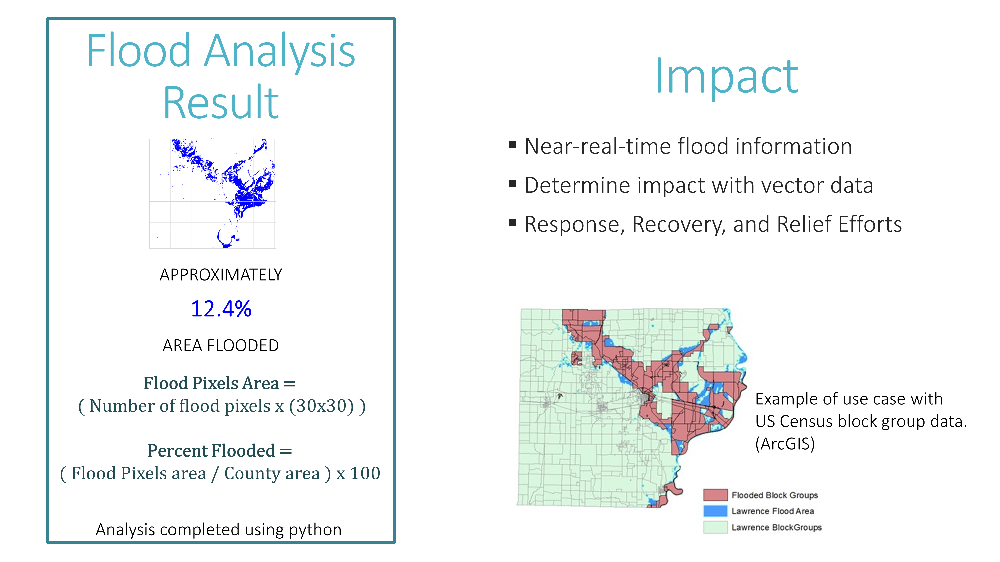

# Flood_Extent_Analysis
Assessing the Extent of a Flood Event using Python: A Change Detection Approach with Landsat Imagery

### Tools: 
* ``earthpy package``: [Earth Lab/Earth Py](https://github.com/earthlab/earthpy)

### Results:

